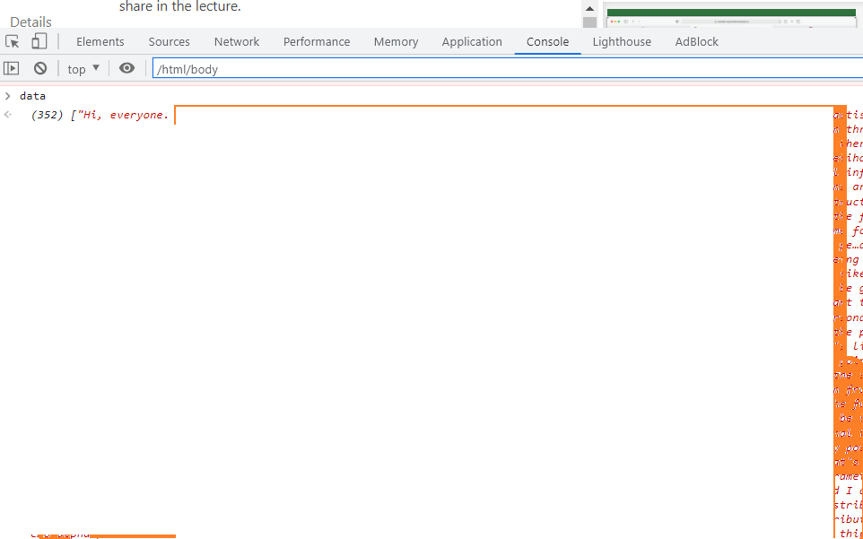
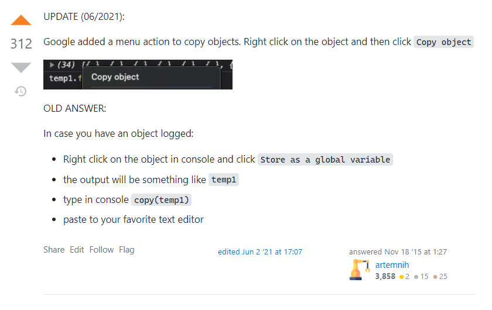

## 
Extract transcripts from panopto video stream

## Run these code in console 

```

data = subscripts.map(function(element){return element.querySelector('.event-text > span').textContent})
data

```
You should see something like this, I have deleted and correputed the data



then you can save it using these steps from stackoverfloew

https://stackoverflow.com/questions/11849562/how-to-save-the-output-of-a-console-logobject-to-a-file


